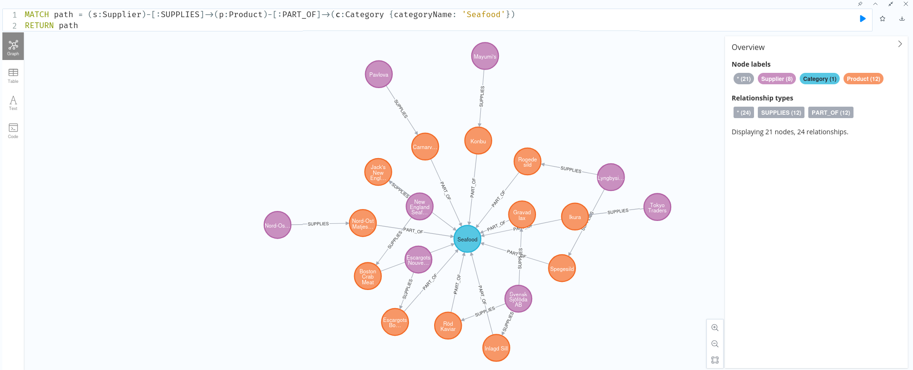

# Infrastructure as Code per la distribuzione di Neo4j su Kubernetes
## Introduzione
Questo progetto implementa un’infrastruttura **Infrastructure as Code (IaC)** per il deploy automatizzato di un database a grafo **Neo4j** su un cluster **Kubernetes**.  
L’obiettivo è automatizzare la configurazione e la distribuzione dell’applicazione utilizzando il software **Terraform**.
## Cluster 
Il cluster Kubernetes è costituito da due macchine virtuali Lubuntu 24 connesse tramite una rete con NAT gestita da VirtualBox (`192.168.43.0/24`):
- nodo 1 (**master**): `192.168.43.10`
- nodo 2 (**worker**): `192.168.43.11`
## Prerequisiti
- openssh-server per l'accesso in remoto e chiavi SSH
- Kubernetes
## Installazione di Terraform
Sul nodo master, eseguire i seguenti comandi:
```bash
wget -O - https://apt.releases.hashicorp.com/gpg | sudo gpg --dearmor -o /usr/share/keyrings/hashicorp-archive-keyring.gpg

echo "deb [arch=$(dpkg --print-architecture) signed-by=/usr/share/keyrings/hashicorp-archive-keyring.gpg] https://apt.releases.hashicorp.com $(grep -oP '(?<=UBUNTU_CODENAME=).*' /etc/os-release || lsb_release -cs) main" | sudo tee /etc/apt/sources.list.d/hashicorp.list

sudo apt update && sudo apt install terraform
```
## Deploy del progetto Terraform
Il deploy dell’infrastruttura è gestito tramite Terraform, che utilizza file .tf per descrivere in modo dichiarativo le risorse da creare su Kubernetes.

Di seguito sono descritti i principali file utilizzati nel progetto.
- [`variables.tf`](src/variables.tf) definisce la struttura e le proprietà delle variabili utilizzate
- [`terraform.tfvars`](src/terraform.tfvars): contiene i valori assegnati alle variabili utilizzate per parametrizzare il deploy
- [`providers.tf`](src/providers.tf): definisce i requisiti di Terraform e configura il provider Kubernetes utilizzato per interagire con il cluster
- [`namespace.tf`](src/namespace.tf): definisce il namespace Kubernetes dedicato al deploy dell’applicazione Neo4j.
- [`secrets.tf`](src/secrets.tf): definisce il Secret Kubernetes utilizzato per gestire in modo sicuro le credenziali di accesso al database Neo4j
- [`storage.tf`](src/storage.tf): definisce le risorse di storage persistente necessarie al funzionamento di Neo4j, configurando una StorageClass e un PersistentVolume per la memorizzazione dei dati
Lo storage viene vincolato al nodo worker specificato tramite `node_affinity`, garantendo che i dati persistenti di Neo4j risiedano sul nodo corretto
- [`neo4j-statefulset.tf`](src/neo4j-statefulset.tf): definisce lo **StatefulSet Kubernetes** responsabile del deploy del database Neo4j, configurando il pod, le risorse, le variabili d’ambiente e il collegamento allo storage persistente
- [`neo4j-service.tf`](src/neo4j-service.tf): definisce il **Service Kubernetes** che espone il database Neo4j all’interno del cluster e verso l’esterno tramite NodePort
### Deploy
1. Preparazione del nodo worker: 
   ```bash
   ssh $WORKER_NODE "sudo mkdir -p /mnt/data/neo4j && sudo chown -R 7474:7474 /mnt/data/neo4j && sudo chmod 755 /mnt/data/neo4j"
   ```
   Il volume persistente di Neo4j è vincolato al nodo worker e utilizza il percorso locale /mnt/data/neo4j. La directory deve quindi esistere sul filesystem del nodo ed essere accessibile dall’utente utilizzato dal container Neo4j (UID/GID 7474)
2. Deploy dell'infrastruttura sul nodo master:
    ```bash
    # Inizializza Terraform 
    terraform init

    # Applica la configurazione 
    terraform apply
    ```
Per accedere al servizio basta collegarsi a http://192.168.43.11:30074 e inserire le credenziali di accesso.
## Esempio di utilizzo 
È stato utilizzato il dataset [NORTHWIND](https://guides.neo4j.com/northwind/index.html), caricato nel nodo 2 con i seguenti comandi dall'interfaccia neo4j:
```cypher
// Carica i prodotti
LOAD CSV WITH HEADERS FROM "https://data.neo4j.com/northwind/products.csv" AS row
MERGE (n:Product {productID: row.productID})
SET n.name = row.productName, n.unitPrice = toFloat(row.unitPrice);

// Carica le categorie
LOAD CSV WITH HEADERS FROM "https://data.neo4j.com/northwind/categories.csv" AS row
MERGE (n:Category {categoryID: row.categoryID})
SET n.categoryName = row.categoryName, n.description = row.description;

// Carica i fornitori
LOAD CSV WITH HEADERS FROM "https://data.neo4j.com/northwind/suppliers.csv" AS row
MERGE (n:Supplier {supplierID: row.supplierID})
SET n.companyName = row.companyName;

// Crea le relazioni (Prodotti appartengono a Categorie)
LOAD CSV WITH HEADERS FROM "https://data.neo4j.com/northwind/products.csv" AS row
MATCH (p:Product {productID: row.productID})
MATCH (c:Category {categoryID: row.categoryID})
MERGE (p)-[:PART_OF]->(c);

// Crea le Relazioni (Fornitori forniscono Prodotti)
LOAD CSV WITH HEADERS FROM "https://data.neo4j.com/northwind/products.csv" AS row
MATCH (p:Product {productID: row.productID})
MATCH (s:Supplier {supplierID: row.supplierID})
MERGE (s)-[:SUPPLIES]->(p);
```
### Esempio di Cypher query 
La seguente query ricerca l'intera filiera di fornitura per la categoria 'Seafood':
```cypher
MATCH path = (s:Supplier)-[:SUPPLIES]->(p:Product)-[:PART_OF]->(c:Category {categoryName: 'Seafood'})
RETURN path
```

La figura mostra il grafo risultante, che visualizza il percorso completo (path) che connette i nodi Supplier ai nodi Product, fino al nodo Category di destinazione.
